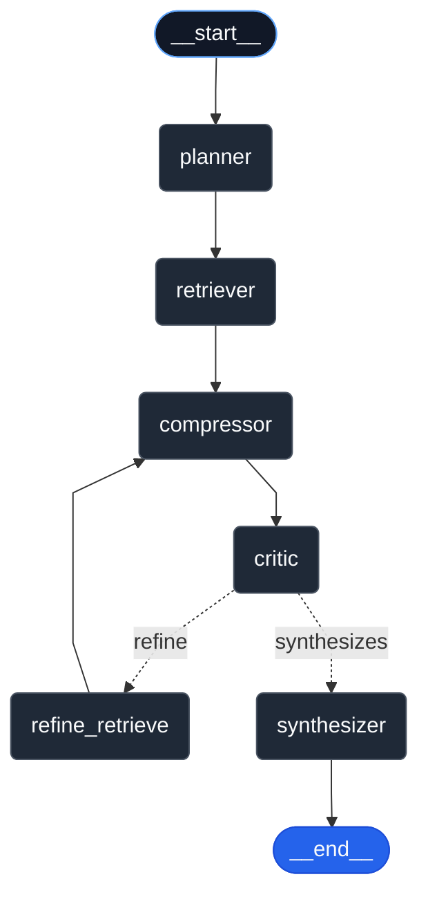

# 🧠 Deep RAG — Agentic Retrieval-Augmented Generation Pipeline

Deep RAG is a modular, production-ready Retrieval-Augmented Generation (RAG) system for querying and reasoning over PDFs (text + images). It combines deterministic PDF parsing with hybrid (lexical + vector) retrieval, cross-encoder reranking, and an agentic multi-stage reasoning loop inspired by "deep-thinking RAG" architectures.



---

# Project Structure

The project is organized into separate backend and frontend components:

```
deep_rag/                          # Project root
├── deep_rag_backend/              # Backend API (FastAPI)
│
├── deep_rag_frontend_vue/         # Frontend UI (Vue.js)
│
├── vector_db/                     # Database schemas and migrations
│
├── docker-compose.yml             # Full stack orchestration (all 3 services)
├── .env.example                   # Root environment template (all services)
├── .gitignore                     # Root gitignore
├── md_guides/                     # Markdown guides
├── makefile                       # Make scripts
├── pyproject.toml                 # TOML Scripts
├── cli.py                         # Command-line Python scripts
└── README.md                      # This file
```

# 🧩 Prerequisites

- **Python ≥ 3.11** (required for Google Gemini support due to 3.10 support deprecation in 2026)  
- **Docker & Docker Compose**
- **NodeJS (npm)**  
- **(Optional) Tesseract OCR + Poppler** (for scanned PDFs)

## Install System Dependencies

```bash
# Ubuntu/Debian
sudo apt install tesseract-ocr poppler-utils -y

# macOS
brew install tesseract poppler
```
# 🚀 Quick Start
<details>
<summary><strong>🚀 Quick Start</strong> - Click to expand</summary>


## Setup

### 1. Clone the Repository
```bash
git clone https://github.com/scmclimited/deep_rag.git
cd deep_rag
```

### 2. Create Virtual Environment
```bash
# Ensure Python 3.11+ is installed
python --version  # Should be 3.11 or higher

# Create virtual environment
python -m venv .venv
source .venv/bin/activate      # On Windows: .venv\Scripts\activate
```

### 3. Install Dependencies

**For Backend:**
```bash
cd deep_rag_backend
pip install --upgrade pip
pip install -r requirements.txt
```

**For Frontend:**
```bash
cd deep_rag_frontend
pip install --upgrade pip
pip install -r requirements.txt
```

### 4. Configure Environment

<details>
<summary><strong>Environment Setup Details</strong> - Click to expand</summary>

**Root `.env` file (for full stack):**
```bash
# From project root (deep_rag/)
cp .env.example .env

# Edit .env and fill in:
#   - Database credentials (DB_USER, DB_PASS, DB_NAME)
#   - LLM API key (GEMINI_API_KEY)
#   - Embedding model (CLIP_MODEL, EMBEDDING_DIM)
```

**Component-specific `.env` files (for independent services):**
```bash
# Backend (from deep_rag_backend/ directory)
cd deep_rag_backend
cp .env.example .env

# Frontend (from deep_rag_frontend/ directory)
cd deep_rag_frontend
cp .env.example .env

# Database (from vector_db/ directory)
cd vector_db
cp .env.example .env
```

Then edit `.env` files with your actual credentials and API keys.  
**Never commit `.env` to git** - it contains sensitive information.

The `.env.example` file contains all required environment variables with sample values. See [`md_guides/ENVIRONMENT_SETUP.md`](md_guides/ENVIRONMENT_SETUP.md) for detailed configuration options.

**Required Variables:**
- **Database**: `DB_HOST`, `DB_PORT`, `DB_USER`, `DB_PASS`, `DB_NAME`
- **LLM**: `LLM_PROVIDER`, `GEMINI_API_KEY`, `GEMINI_MODEL`, `LLM_TEMPERATURE`
- **Embeddings**: `CLIP_MODEL`, `EMBEDDING_DIM`

**Optional Variables:**
- **Startup Tests**: `RUN_TESTS_ON_STARTUP` (set to `true` to run database schema tests on container startup)
- **Endpoint Tests on Boot**: `AUTOMATE_ENDPOINT_RUNS_ON_BOOT` (set to `true` to run endpoint tests after `make up-and-test`)

</details>

### 5. Start Services
```bash
# All commands run from project root (deep_rag/)

# Option 1: Start full stack (DB + API + Frontend)
make up              # Or: docker compose up -d --build

# Option 2: Start and run tests automatically
make up-and-test     # Starts services, then runs all tests to verify setup
                     # Optionally runs endpoint tests if AUTOMATE_ENDPOINT_RUNS_ON_BOOT=true

# Option 3: Start DB only (for local development)
make db-up           # Or: cd vector_db && docker-compose up -d
```

**Note:** The Docker container uses an entrypoint script (`deep_rag_backend/scripts/entrypoint.sh`) that:
- **Optionally runs database schema tests on startup** if `RUN_TESTS_ON_STARTUP=true` is set in your `.env`
  - Verifies all required tables exist (`documents`, `chunks`, `thread_tracking`)
  - Ensures database schema is properly initialized
  - Default: `false` (tests are not run on startup)
- Starts the FastAPI server on port 8000
- Provides health check endpoint at `/health` that verifies database connection and required tables

**To enable startup tests**, add to your `.env`:
```bash
RUN_TESTS_ON_STARTUP=true
```

**To enable endpoint tests on boot**, add to your `.env`:
```bash
AUTOMATE_ENDPOINT_RUNS_ON_BOOT=true
```
This will run `make test-endpoints` (full suite: Make + REST API) after `make up-and-test` completes, verifying all endpoints work correctly.

See [`deep_rag_backend/scripts/entrypoint.sh`](deep_rag_backend/scripts/entrypoint.sh) for details on startup tests.

### 6. Verify Services
```bash
# Check running containers
docker ps
# Should show: deep_rag_pgvector and deep_rag_api running

# Check API health (verifies database connection and schema)
curl http://localhost:5173/api/health
# Should return: {"ok": true, "status": "healthy", "database": "connected", "tables": ["chunks", "documents", "thread_tracking"]}
```

</details>


## Docker Deployment

All Docker images use **Python 3.11** to ensure compatibility with Google Gemini SDK.

### Full Stack (Recommended)

Run all three services together (database, backend API, frontend):

```bash
# From project root (deep_rag/)
docker-compose up -d

# Services will be available at:
# - Frontend: http://localhost:5173
# - Backend API: http://localhost:8000 (also proxied at http://localhost:5173/api)
# - Database: localhost:5432
```

**View logs:**
```bash
# All services
docker-compose logs -f

# Specific service
docker-compose logs -f api
docker-compose logs -f frontend
docker-compose logs -f db
```

**Stop services:**
```bash
docker-compose down
```

### Independent Services

Each service can run independently with its own `docker-compose.yml`:

**Backend Only:**
```bash
cd deep_rag_backend
docker-compose up -d
# Backend API: http://localhost:8000 (also proxied at http://localhost:5173/api)
# Note: Requires database to be running separately
```

**Frontend Only:**
```bash
cd deep_rag_frontend
docker-compose up -d
# Frontend: http://localhost:5173
# Note: Requires backend API to be running
# Set API_BASE_URL in .env to point to backend
```

**Database Only:**
```bash
cd vector_db
docker-compose up -d
# Database: localhost:5432
# Note: Other services can connect to this database
```

---

<details>
<summary><strong>🚀 Features</strong> - Click to expand</summary>

# 🚀 Features

| Layer | Description |
|-------|--------------|
| **Ingestion** | Multi-modal ingestion: PDFs (text + OCR), plain text files, and images (PNG/JPEG). Extracts text using PyMuPDF (`fitz`) with OCR fallback (`pytesseract`). Chunks and embeds with **CLIP-ViT-L/14** (`sentence-transformers/clip-ViT-L-14`) into unified **768-dimensional vectors** in Postgres + pgvector. **Upgraded from ViT-B/32 (512 dims)** for better semantic representation. |
| **Retrieval** | Hybrid search combining pg_trgm (BM25-style) lexical scores + vector similarity (cosine distance). Reranked by a cross-encoder (`bge-reranker-base`). Supports multi-modal queries (text + images). Dynamically supports 512 or 768 dimensional embeddings. **Supports two-stage retrieval with `--cross-doc` flag** for cross-document semantic search. |
| **Agentic Loop** | Two pipeline options: (1) **Direct pipeline** (`deep_rag_backend/inference/agents/pipeline.py`): Linear execution (plan → retrieve → compress → reflect → synthesize). (2) **LangGraph pipeline** (`deep_rag_backend/inference/graph/builder.py`): Conditional routing with iterative refinement - agents can refine queries and retrieve more evidence when confidence < threshold. **Includes comprehensive logging** to CSV/TXT for future SFT training. |
| **LLM Integration** | Currently using **Google Gemini** for agentic reasoning. **Recommended models**: `gemini-1.5-flash` (1M token context, best balance) or `gemini-2.0-flash` (latest, improved reasoning). Alternative: `gemini-2.5-flash-lite` for faster, lightweight processing. Code structure supports future integration with OpenAI, Ollama, and LLaVA. |
| **Multi-modal Support** | Unified embedding space for text and images using CLIP-ViT-L/14 (768 dims), enabling semantic search across different content types with better representation than ViT-B/32. |
| **Cross-Document Retrieval** | **NEW**: `--cross-doc` flag enables two-stage retrieval. When `doc_id` is provided: Stage 1 retrieves from the specified document, Stage 2 uses combined query (original + retrieved content) for semantic search across all documents. When no `doc_id`: Enables general cross-document semantic search. Results are merged and deduplicated. |
| **Document Context** | Document ID (`doc_id`) tracking throughout the pipeline. Enables document-specific filtering, context-aware planning and synthesis, and automatic document identification from retrieved chunks. |
| **Thread Tracking** | **NEW**: Comprehensive audit logging via `thread_tracking` table. Tracks user interactions, thread sessions, document retrievals, pipeline states, and entry points for SFT/RLHF training and analysis. See [`md_guides/THREAD_TRACKING_AND_AUDIT.md`](md_guides/THREAD_TRACKING_AND_AUDIT.md). |
| **Reasoning Logs** | All agentic reasoning steps are logged to `inference/graph/logs/` in both CSV (for training) and TXT (for presentations). Captures queries, plans, retrievals, confidence scores, and refinements for future SFT model training. |
| **Modular Architecture** | Fully modularized codebase with focused modules for agents, LLM providers, retrieval stages, embeddings, database operations, and diagnostics. Improves legibility, testing, and context switching. |
| **Comprehensive Testing** | Unit tests for all modules and integration tests for LLM providers and end-to-end workflows. **Automated endpoint testing scripts** verify all ingest, query, and infer endpoints work correctly. Tests can be run via CLI, Make, TOML, or direct Pytest. |
| **Microservice Ready** | FastAPI REST interface with comprehensive endpoints for ingestion, querying (direct and LangGraph), and health checks. |
| **CLI Ready** | Typer CLI matching all REST endpoints for easy local development and testing. |
| **Containerized DB** | pgvector/pg16 Docker image with automatic schema init via mounted SQL file. Support for fresh database starts and migrations. |

</details>

---

<details>
<summary><strong>🎯 Entry Points</strong> - Click to expand</summary>

# 🎯 Entry Points

The Deep RAG system provides multiple entry points (CLI, Make, TOML, REST API) for different use cases:

## Entry Point Mapping Table

| CLI Command | Make Script | REST Endpoint | Purpose | Pipeline |
|------------|-------------|---------------|---------|----------|
| `ingest` | `make cli-ingest` | `POST /ingest` | **Ingestion only**: Embeds documents into vector DB without querying. Use when you want to pre-populate your knowledge base. | Direct |
| `query` | `make query` | `POST /ask` | **Query only (direct pipeline)**: Fast, deterministic pipeline for simple queries. No conditional routing. Best for straightforward questions. Supports `--doc-id` and `--cross-doc` flags. | Direct (`deep_rag_backend/inference/agents/pipeline.py`) |
| `query-graph` | `make query-graph` | `POST /ask-graph` | **Query only (LangGraph)**: Agentic pipeline with conditional routing. Agents can refine queries and retrieve more evidence if confidence is low. Best for complex questions requiring iterative reasoning. Supports `--doc-id`, `--thread-id`, and `--cross-doc` flags. | LangGraph |
| `infer` | `make infer` | `POST /infer` | **Ingest + Query (direct pipeline)**: Combined ingestion and querying in one operation. Use when you have a document and want immediate answers with fast, deterministic processing. Supports `--file`, `--title`, and `--cross-doc` flags. | Direct (`deep_rag_backend/inference/agents/pipeline.py`) |
| `infer-graph` | `make infer-graph` | `POST /infer-graph` | **Ingest + Query (LangGraph)**: Combined ingestion with agentic reasoning. Best when you need to ingest and then perform complex reasoning over the new content. Supports `--file`, `--title`, `--thread-id`, and `--cross-doc` flags. | LangGraph |
| `health` | `make health` | `GET /health` | **Health check**: Verifies database connectivity and service availability. | - |
| `graph` | `make graph` | `GET /graph` | **Graph export**: Exports LangGraph pipeline visualization as PNG or Mermaid diagram. Useful for understanding the agentic flow. | LangGraph |
| `inspect` | `make inspect` | `GET /diagnostics/document` | **Document diagnostics**: Inspects what chunks and pages are stored for a document. Shows page distribution, chunk counts, and sample text. Essential for debugging ingestion and retrieval issues. | - |
| `test` | `make test` | - | **Testing**: Run all tests (unit + integration). Supports `--docker` flag. | ALL |
| `test unit` | `make unit-tests` | - | **Unit tests only**: Run unit tests for individual modules. Supports `--docker` flag. | ALL |
| `test integration` | `make integration-tests` | - | **Integration tests only**: Run integration tests for end-to-end workflows. Supports `--docker` flag. | - |
| - | `make test-endpoints` | ALL | **Endpoint testing**: Test all ingest/query/infer endpoints (Make + REST). Verifies all endpoints work correctly. | - |
| - | `make test-endpoints-quick` | ALL | **Quick endpoint test**: Test one example of each endpoint type. Fast verification. | - |

### Pipeline Comparison

- **Direct Pipeline** (`deep_rag_backend/inference/agents/pipeline.py`): Linear execution, faster, deterministic. Best for simple queries.
- **LangGraph Pipeline** (`deep_rag_backend/inference/graph/builder.py`): Conditional routing, agents can refine queries, iterative retrieval. Best for complex questions requiring multi-step reasoning.

For detailed scenarios and use cases for each entry point, see [`md_guides/ENTRY_POINTS_AND_SCENARIOS.md`](md_guides/ENTRY_POINTS_AND_SCENARIOS.md).

</details>

---

<details>
<summary><strong>🚩 Flags and Options</strong> - Click to expand</summary>

# 🚩 Flags and Options

## `--cross-doc` Flag

The `--cross-doc` flag enables **cross-document retrieval**, allowing the system to search beyond a single specified document for more comprehensive answers.

### Behavior

#### When `doc_id` is Provided

**Without `--cross-doc`**: Retrieval is strictly limited to the specified `doc_id` only.

**With `--cross-doc`**: Performs **two-stage retrieval**:
1. **Stage 1 (Primary)**: Retrieves content from the specified `doc_id`
2. **Stage 2 (Cross-Document)**: Uses the original query combined with retrieved content from Stage 1 to formulate a semantic search query across **all documents** (including the primary `doc_id` for semantic search, but prioritizing primary results)
3. **Merge & Deduplicate**: Results from both stages are combined and deduplicated, with primary chunks prioritized

**Use Case**: When you want to start with a specific document but also find related information across your entire knowledge base.

#### When No `doc_id` is Provided

**Without `--cross-doc`**: Standard retrieval searches across all documents.

**With `--cross-doc`**: Enables enhanced cross-document semantic search with better query expansion and semantic matching.

**Use Case**: When you want the most comprehensive answer possible from your entire knowledge base.

<details>
<summary><strong>Examples</strong> - Click to expand</summary>

#### CLI (from `deep_rag_backend/` directory)
```bash
cd deep_rag_backend
# Query with doc_id + cross-doc (two-stage retrieval)
python -m inference.cli query "What are the requirements?" --doc-id 550e8400-e29b-41d4-a716-446655440000 --cross-doc

# Query all documents with cross-doc enabled
python -m inference.cli query "What are the requirements?" --cross-doc

# Ingest + Query with cross-doc
python -m inference.cli infer "What does this document say?" --file "path/to/file.pdf" --cross-doc
```

#### Make (from project root `deep_rag/`)
```bash
# Query with doc_id + cross-doc
make query Q="What are the requirements?" DOC_ID=550e8400-e29b-41d4-a716-446655440000 CROSS_DOC=true DOCKER=true

# Query all documents with cross-doc
make query Q="What are the requirements?" CROSS_DOC=true DOCKER=true

# Ingest + Query with cross-doc
make infer Q="What does this document say?" FILE="path/to/file.pdf" CROSS_DOC=true DOCKER=true
```

#### REST API
```bash
# Query with doc_id + cross-doc
curl -X POST http://localhost:5173/api/ask \
  -H "Content-Type: application/json" \
  -d '{"question": "What are the requirements?", "doc_id": "550e8400-e29b-41d4-a716-446655440000", "cross_doc": true}'

# Query all documents with cross-doc
curl -X POST http://localhost:5173/api/ask \
  -H "Content-Type: application/json" \
  -d '{"question": "What are the requirements?", "cross_doc": true}'
```

</details>

### When to Use `--cross-doc`

- ✅ **Use when**: You want comprehensive answers that may span multiple documents
- ✅ **Use when**: You have a primary document but want to find related information elsewhere
- ✅ **Use when**: You're unsure which document contains the answer
- ❌ **Don't use when**: You need strict document-specific answers
- ❌ **Don't use when**: You want faster, more focused retrieval from a single document

## Other Flags

### `--doc-id` (Document ID)
Filters retrieval to a specific document. See [Document ID (`doc_id`) and Context Reasoning](#-document-id-doc_id-and-context-reasoning) section.

### `--thread-id` (Thread ID)
Used with LangGraph pipeline to maintain conversation state across multiple queries. Default: `"default"`.

### `--title` (Document Title)
Custom title for documents during ingestion. If not provided, extracted from document content.

### `--file` (File Path)
File path for ingestion (PDF, TXT, PNG, JPEG). Used with `infer` and `infer-graph` commands.

### `--docker` (Docker Flag)
Run commands inside Docker container. Used with Make scripts and CLI test commands.

### `--verbose` / `--quiet` (Verbosity)
Control output verbosity. Used with CLI test commands.

</details>

---

<details>
<summary><strong>📄 Document ID (`doc_id`) and Context Reasoning</strong> - Click to expand</summary>

# 📄 Document ID (`doc_id`) and Context Reasoning

## Overview

Deep RAG uses **Document IDs (`doc_id`)** to enable document-specific retrieval and context-aware reasoning. Every chunk in the vector database is linked to its source document via a `doc_id` UUID, allowing the system to:

- **Filter retrieval** to specific documents when needed
- **Track provenance** of retrieved information
- **Provide document context** to the LLM for better reasoning
- **Identify document sources** from retrieved chunks when querying without ingestion

## Database Schema

The `doc_id` is stored in the PostgreSQL `chunks` table:

```sql
CREATE TABLE chunks (
  chunk_id    UUID PRIMARY KEY,
  doc_id      UUID REFERENCES documents(doc_id) ON DELETE CASCADE,
  page_start  INT,
  page_end    INT,
  text        TEXT NOT NULL,
  emb         vector(768),  -- pgvector embedding
  ...
);
```

**Key Points:**
- `doc_id` is a UUID that references the `documents` table
- Every chunk is linked to its source document via `doc_id`
- `ON DELETE CASCADE` ensures chunks are deleted when a document is removed
- `doc_id` is included in all retrieval queries and results

## How `doc_id` Flows Through the System

### During Ingestion

When a document is ingested (PDF, TXT, PNG, JPEG), the system:
1. Creates a new document record in the `documents` table → generates `doc_id`
2. Chunks the document content
3. Embeds each chunk
4. Inserts chunks into the `chunks` table with the `doc_id` reference
5. **Returns the `doc_id`** to the caller

### During Retrieval

When querying, the system:
1. **If `doc_id` is provided**: Filters retrieval to chunks from that specific document
2. **If `doc_id` is not provided**: Searches across all documents in the knowledge base
3. **If `doc_id` is not provided but chunks are retrieved**: The synthesizer can identify `doc_id` from retrieved chunks (if all chunks come from one document)

### During Synthesis

The synthesizer uses `doc_id` context to:
- Include document-specific context in the LLM prompt
- Provide better reasoning about which document the answer is based on
- Log which document(s) were used for the answer

## Usage Scenarios

For detailed scenarios and examples, see [`md_guides/ENTRY_POINTS_AND_SCENARIOS.md`](md_guides/ENTRY_POINTS_AND_SCENARIOS.md).

</details>

---

<details>
<summary><strong>📖 Usage Examples</strong> - Click to expand</summary>

# 📖 Usage Examples

All entry points are organized below. Choose the method that best fits your workflow.

## Via CLI (Command Line Interface)

<details>
<summary><strong>Run Locally</strong> - Click to expand</summary>

**Important:** All commands below must be run from the **`deep_rag_backend/` directory**. Python needs to find the `inference` package in the local filesystem, which is located in `deep_rag_backend/inference/`.

**Alternative:** After installing the project as a package (`pip install -e .` from project root), you can use the global `deep-rag` command from any directory (see [Via TOML Script](#via-toml-script-pyprojecttoml) section).

```bash
# Navigate to backend directory first
cd deep_rag_backend

# Ingest a document
python -m inference.cli ingest "path/to/file.pdf"
python -m inference.cli ingest "path/to/file.pdf" --title "Custom Title"

# Query existing documents
python -m inference.cli query "What are the main sections?"
python -m inference.cli query "What are the requirements?" --doc-id 550e8400-e29b-41d4-a716-446655440000
python -m inference.cli query "What are the requirements?" --doc-id 550e8400-e29b-41d4-a716-446655440000 --cross-doc
python -m inference.cli query-graph "What are the requirements?" --thread-id session-1
python -m inference.cli query-graph "What are the requirements?" --doc-id 550e8400-e29b-41d4-a716-446655440000 --thread-id session-1 --cross-doc

# Ingest + Query in one command
python -m inference.cli infer "What does this document say?" --file "path/to/file.pdf"
python -m inference.cli infer "What does this document say?" --file "path/to/file.pdf" --cross-doc
python -m inference.cli infer-graph "Analyze this document" --file "path/to/file.pdf" --title "Doc Title" --thread-id session-1

# Inspect stored chunks and pages (debugging)
python -m inference.cli inspect --title "Document Title"
python -m inference.cli inspect --doc-id your-doc-id-here
python -m inference.cli inspect  # List all documents

# Export graph visualization
python -m inference.cli graph --out inference/graph/artifacts/deep_rag_graph.png

# Health check
python -m inference.cli health

# Testing
python -m inference.cli test all          # Run all tests (unit + integration)
python -m inference.cli test unit         # Run unit tests only
python -m inference.cli test integration   # Run integration tests only
```

</details>

<details>
<summary><strong>Run Inside Docker</strong> - Click to expand</summary>

**Important:** All `docker compose` commands below must be run from the **project root** (`deep_rag/`). The `docker-compose.yml` file is located at the project root, and Docker Compose needs to find it to operate on the services.

**Note:** Inside the Docker container, `inference` is a Python package (not a directory path). The backend code from `deep_rag_backend/` is mounted/copied into the container, making `inference` available as a Python module. The `api` service container references the `deep_rag_api` service defined in the root `docker-compose.yml`.

```bash
# All commands below run from project root (deep_rag/)

# Start the stack
docker compose up -d --build

# Ingest a document (inside Docker container)
docker compose exec api python -m inference.cli ingest "inference/samples/file.pdf"
docker compose exec api python -m inference.cli ingest "inference/samples/file.pdf" --title "Custom Title"

# Query documents (inside Docker container)
docker compose exec api python -m inference.cli query "What are the requirements?"
docker compose exec api python -m inference.cli query "What are the requirements?" --doc-id 550e8400-e29b-41d4-a716-446655440000 --cross-doc
docker compose exec api python -m inference.cli query-graph "Complex question" --thread-id session-1

# Inspect stored chunks (inside Docker container)
docker compose exec api python -m inference.cli inspect --title "Document Title"
docker compose exec api python -m inference.cli inspect --doc-id your-doc-id-here

# Run tests (inside Docker container)
docker compose exec api python -m inference.cli test all
docker compose exec api python -m inference.cli test unit
docker compose exec api python -m inference.cli test integration
```

**Key Differences:**
- **Local CLI** (above):** Requires `cd deep_rag_backend` because Python needs to find the `inference` package in the local filesystem
- **Docker CLI** (here): Run from project root; `inference` is available inside the container as a Python package, so no directory navigation needed

</details>

---

## Via Make Scripts

**Note:** All Make commands can be run from the **project root** (`deep_rag/`). The root Makefile orchestrates all services and delegates backend-specific commands to `deep_rag_backend/makefile` with proper directory context.

<details>
<summary><strong>Install Make</strong> - Click to expand</summary>

```bash
# Check if installed
make --version

# Install if needed:
# Ubuntu/Debian/WSL: sudo apt update && sudo apt install -y make build-essential
# macOS: xcode-select --install
# Windows: choco install make
```

</details>

<details>
<summary><strong>Common Commands</strong> - Click to expand</summary>

```bash
# All commands run from project root (deep_rag/)

# Start/stop services
make up              # Start full stack (DB + API + Frontend)
make down            # Stop and remove containers/volumes
make logs            # Tail logs from all services
make rebuild         # Rebuild all images and restart stack

# DB-only operations
make db-up           # Start DB only
make db-down         # Stop DB-only stack

# Ingest documents
make cli-ingest FILE="path/to/file.pdf" DOCKER=true
make cli-ingest FILE="path/to/file.pdf" DOCKER=true TITLE="Custom Title"

# Query documents
make query Q="Your question here" DOCKER=true
make query Q="Your question here" CROSS_DOC=true DOCKER=true
make query-graph Q="Complex question" DOCKER=true THREAD_ID=session-1

# Query specific document by doc_id
make query Q="What are the requirements?" DOCKER=true DOC_ID=550e8400-e29b-41d4-a716-446655440000
make query Q="What are the requirements?" DOCKER=true DOC_ID=550e8400-e29b-41d4-a716-446655440000 CROSS_DOC=true
make query-graph Q="What are the requirements?" DOCKER=true THREAD_ID=session-1 DOC_ID=550e8400-e29b-41d4-a716-446655440000 CROSS_DOC=true

# Ingest + Query
make infer Q="Your question" FILE="path/to/file.pdf" TITLE="Title" DOCKER=true
make infer Q="Your question" FILE="path/to/file.pdf" TITLE="Title" CROSS_DOC=true DOCKER=true
make infer-graph Q="Your question" FILE="path/to/file.pdf" TITLE="Title" DOCKER=true THREAD_ID=session-1

# Diagnostics
make inspect TITLE="Document Title" DOCKER=true
make inspect DOC_ID=your-doc-id-here DOCKER=true
make inspect DOCKER=true  # List all documents

# Graph visualization
make graph OUT=deep_rag_backend/inference/graph/artifacts/deep_rag_graph.png DOCKER=true

# Testing
make test                  # Run all tests (unit + integration)
make unit-tests           # Run unit tests only
make integration-tests    # Run integration tests only
make test DOCKER=true     # Run tests inside Docker container

# Endpoint Testing
make test-endpoints       # Test all ingest/query/infer endpoints (Make + REST)
make test-endpoints-make  # Test endpoints via Make commands
make test-endpoints-rest  # Test endpoints via REST API (curl)
make test-endpoints-quick # Quick test (one example of each endpoint type)
```

**Alternative: Run from Backend Directory**

If you prefer to run Make commands from the backend directory:
```bash
# From deep_rag_backend directory
cd deep_rag_backend
make up              # Start backend stack (uses backend docker-compose.yml)
make query Q="..." DOCKER=true
# ... etc
```

</details>

---

## Via TOML Script (pyproject.toml)

**Install project as package:**
```bash
# From project root (deep_rag/)
pip install -e .
```

**Note:** Installing the root package will install all backend dependencies. The `deep-rag` CLI command will be available globally and will delegate to the backend CLI with proper path handling, allowing you to run commands from any directory.

<details>
<summary><strong>Command Examples</strong> - Click to expand</summary>

```bash
# All commands can be run from any directory after installation

# Ingest
deep-rag ingest path/to/file.pdf
deep-rag ingest path/to/file.pdf --title "Custom Title"

# Query
deep-rag query "What are the main sections?"
deep-rag query "What are the requirements?" --doc-id 550e8400-e29b-41d4-a716-446655440000
deep-rag query "What are the requirements?" --doc-id 550e8400-e29b-41d4-a716-446655440000 --cross-doc
deep-rag query-graph "What are the requirements?" --thread-id session-1

# Ingest + Query
deep-rag infer "Question" --file path/to/file.pdf
deep-rag infer "Question" --file path/to/file.pdf --cross-doc
deep-rag infer-graph "Question" --file path/to/file.pdf --title "Title" --thread-id session-1

# Diagnostics
deep-rag inspect --title "Document Title"
deep-rag inspect --doc-id your-doc-id-here
deep-rag inspect  # List all documents

# Graph visualization
deep-rag graph --out inference/graph/artifacts/deep_rag_graph.png

# Testing
deep-rag test all          # Run all tests (unit + integration)
deep-rag test unit         # Run unit tests only
deep-rag test integration  # Run integration tests only
deep-rag test all --docker # Run tests inside Docker container
```

</details>

---

## Via REST API

<details>
<summary><strong>Start the API Server</strong> - Click to expand</summary>

**Important:** Docker Compose commands must be run from the **project root** (`deep_rag/`). Local server commands must be run from the **`deep_rag_backend/` directory**.

```bash
# Option 1: Start full stack with Docker (from project root)
docker compose up -d --build

# Option 2: Run locally (requires dependencies installed, from deep_rag_backend directory)
cd deep_rag_backend
uvicorn inference.service:app --host 0.0.0.0 --port 8000
```

**Note:** The Docker approach is recommended as it handles all dependencies and service orchestration automatically.

</details>

<details>
<summary><strong>API Endpoints</strong> - Click to expand</summary>

#### POST /ingest (File Upload)
```bash
curl -X POST http://localhost:5173/api/ingest \
  -F "attachment=@path/to/file.pdf" \
  -F "title=Optional Document Title"
```

#### POST /ask (Query - Direct Pipeline)
```bash
# Query all documents
curl -X POST http://localhost:5173/api/ask \
  -H "Content-Type: application/json" \
  -d '{"question": "What is the document about?"}'

# Query specific document by doc_id
curl -X POST http://localhost:5173/api/ask \
  -H "Content-Type: application/json" \
  -d '{"question": "What is the document about?", "doc_id": "550e8400-e29b-41d4-a716-446655440000"}'

# Query with cross-doc enabled
curl -X POST http://localhost:5173/api/ask \
  -H "Content-Type: application/json" \
  -d '{"question": "What is the document about?", "doc_id": "550e8400-e29b-41d4-a716-446655440000", "cross_doc": true}'
```

#### POST /ask-graph (Query - LangGraph Pipeline)
```bash
# Query all documents
curl -X POST http://localhost:5173/api/ask-graph \
  -H "Content-Type: application/json" \
  -d '{"question": "What are the specific requirements?", "thread_id": "session-1"}'

# Query specific document by doc_id
curl -X POST http://localhost:5173/api/ask-graph \
  -H "Content-Type: application/json" \
  -d '{"question": "What are the specific requirements?", "thread_id": "session-1", "doc_id": "550e8400-e29b-41d4-a716-446655440000"}'

# Query with cross-doc enabled
curl -X POST http://localhost:5173/api/ask-graph \
  -H "Content-Type: application/json" \
  -d '{"question": "What are the specific requirements?", "thread_id": "session-1", "doc_id": "550e8400-e29b-41d4-a716-446655440000", "cross_doc": true}'
```

#### POST /infer (Ingest + Query - Direct)
```bash
curl -X POST http://localhost:5173/api/infer \
  -F "question=What does this document say about RAG systems?" \
  -F "attachments=@path/to/file.pdf" \
  -F "title=Optional Title"

# With cross-doc enabled
curl -X POST http://localhost:5173/api/infer \
  -F "question=What does this document say about RAG systems?" \
  -F "attachments=@path/to/file.pdf" \
  -F "title=Optional Title" \
  -F "cross_doc=true"
```

#### POST /infer-graph (Ingest + Query - LangGraph)
```bash
curl -X POST http://localhost:5173/api/infer-graph \
  -F "question=What are the key requirements for this RAG system?" \
  -F "attachments=@path/to/file.pdf" \
  -F "title=Optional Title" \
  -F "thread_id=session-1"
```

#### GET /health
```bash
curl http://localhost:5173/api/health
```

#### GET /graph
```bash
curl "http://localhost:5173/api/graph?out=inference/graph/artifacts/deep_rag_graph.png" -o deep_rag_graph.png
```

#### GET /diagnostics/document
```bash
# Inspect by document title (partial match)
curl "http://localhost:5173/api/diagnostics/document?doc_title=NYMBL"

# Inspect by document ID (UUID)
curl "http://localhost:5173/api/diagnostics/document?doc_id=your-doc-id-here"

# List all documents (if no params provided)
curl "http://localhost:5173/api/diagnostics/document"
```

</details>

</details>

---

<details>
<summary><strong>🧠 Multi-Modal Embedding Model</strong> - Click to expand</summary>

# 🧠 Multi-Modal Embedding Model

## Current Model: CLIP-ViT-L/14

Deep RAG uses **CLIP-ViT-L/14** (`sentence-transformers/clip-ViT-L-14`) for multi-modal embeddings, providing a unified vector space for both text and images.

### Model Specifications

| Property | CLIP-ViT-L/14 (Current) | CLIP-ViT-B/32 (Legacy) |
|----------|-------------------------|------------------------|
| **Embedding Dimensions** | **768** | 512 |
| **Max Token Length** | 77 tokens | 77 tokens |
| **Performance** | **Better semantic representation** | Faster, lower memory |
| **Model Size** | ~400MB | ~150MB |
| **Use Case** | Production, high-quality retrieval | Development, resource-constrained |

### Why CLIP-ViT-L/14?

1. **Higher Dimensions (768 vs 512)**: More dimensional space = better semantic representation and retrieval accuracy
2. **Multi-Modal**: Embeds text and images in the same vector space, enabling true multi-modal search
3. **Open-Source & Local**: Runs entirely locally without API dependencies
4. **pgvector Compatible**: 768 dimensions well within pgvector's 2,000 dimension limit
5. **Production Ready**: Better performance for real-world RAG applications

### Model Configuration

Set via environment variables in `.env`:

```bash
# Use CLIP-ViT-L/14 (768 dims, recommended)
CLIP_MODEL=sentence-transformers/clip-ViT-L-14
EMBEDDING_DIM=768

# Or use CLIP-ViT-B/32 (512 dims, faster)
# CLIP_MODEL=sentence-transformers/clip-ViT-B-32
# EMBEDDING_DIM=512
```

For detailed embedding options and selection rationale, see [`md_guides/EMBEDDING_OPTIONS.md`](md_guides/EMBEDDING_OPTIONS.md).

</details>

---

<details>
<summary><strong>🤖 LLM Model Recommendations</strong> - Click to expand</summary>

# 🤖 LLM Model Recommendations

## Gemini Model Selection

Deep RAG uses Google Gemini for agentic reasoning. **Recommended models** (in order of preference):

### 1. **gemini-1.5-flash** (Recommended)
- **Context Window**: 1 million tokens
- **Speed**: Fast (optimized for throughput)
- **Quality**: Excellent reasoning and instruction following
- **Use Case**: Production RAG applications with large documents
- **Cost**: Cost-effective for high-volume usage

### 2. **gemini-2.0-flash** (Latest)
- **Context Window**: 1 million tokens
- **Speed**: Fast with improved performance
- **Quality**: Latest improvements in reasoning and multi-turn conversations
- **Use Case**: Production with latest capabilities
- **Note**: Newer model, may have different behavior

### 3. **gemini-2.5-flash-lite** (Lightweight)
- **Context Window**: Limited (check current specs)
- **Speed**: Very fast
- **Quality**: Good for simple queries
- **Use Case**: Development, cost-constrained environments, simple Q&A
- **Limitation**: May struggle with complex multi-step reasoning

### Configuration

Set in `.env`:
```bash
LLM_PROVIDER=gemini
GEMINI_API_KEY=your_api_key_here
GEMINI_MODEL=gemini-1.5-flash  # Recommended
LLM_TEMPERATURE=0.2
```

For detailed LLM setup and provider selection rationale, see [`md_guides/LLM_SETUP.md`](md_guides/LLM_SETUP.md).

</details>

---

<details>
<summary><strong>🧪 Testing</strong> - Click to expand</summary>

# 🧪 Testing

Deep RAG includes comprehensive unit and integration tests for all modules, agentic pipelines, ingestion pipeline, wrapper functions, logger functions, and graph functions.

## Test Structure

```
deep_rag_backend/tests/
├── unit/                    # Unit tests for individual modules
│   ├── test_retrieval_*.py  # Retrieval module tests
│   ├── test_llm_*.py        # LLM provider tests
│   ├── test_embeddings_text.py  # Embedding model and text embedding tests
│   └── ...
├── integration/             # Integration tests
│   ├── test_llm_providers_*.py  # LLM provider integration tests
│   ├── test_database_schema.py  # Database schema verification tests
│   └── ...
└── conftest.py             # Pytest configuration
```

## Test Commands

<details>
<summary><strong>Via Make Scripts</strong> - Click to expand</summary>

```bash
# All commands run from project root (deep_rag/)

# Run all tests (unit + integration)
make test                  # Run all tests locally
make test DOCKER=true      # Run all tests inside Docker container

# Run unit tests only
make unit-tests           # Run unit tests locally
make unit-tests DOCKER=true  # Run unit tests inside Docker container

# Run integration tests only
make integration-tests    # Run integration tests locally
make integration-tests DOCKER=true  # Run integration tests inside Docker container

# Test all endpoints (ingest, query, infer)
make test-endpoints-quick  # Quick test (one example of each endpoint type)
make test-endpoints        # Full test suite (Make commands + REST API)
make test-endpoints-make  # Test endpoints via Make commands only
make test-endpoints-rest  # Test endpoints via REST API (curl) only
```

**Note:** Endpoint testing scripts automatically test all ingest, query, and infer endpoints, verify all flag combinations (doc_id, cross_doc, thread_id), and check logging and response formats.

See [`deep_rag_backend/scripts/ENDPOINT_TESTING_GUIDE.md`](deep_rag_backend/scripts/ENDPOINT_TESTING_GUIDE.md) for detailed documentation.

</details>

<details>
<summary><strong>Via CLI (Command Line Interface)</strong> - Click to expand</summary>

**Important:** Local commands must be run from **`deep_rag_backend/` directory**. Docker commands must be run from **project root** (`deep_rag/`).

```bash
# Run locally (from deep_rag_backend directory)
cd deep_rag_backend
python -m inference.cli test all
python -m inference.cli test all --verbose  # Verbose output
python -m inference.cli test unit
python -m inference.cli test integration

# Run inside Docker (from project root)
docker compose exec api python -m inference.cli test all
docker compose exec api python -m inference.cli test unit
docker compose exec api python -m inference.cli test integration
```

</details>

<details>
<summary><strong>Via TOML Script (pyproject.toml)</strong> - Click to expand</summary>

```bash
# After installing: pip install -e . (from project root)

# Run all tests
deep-rag test all
deep-rag test all --docker
deep-rag test all --verbose

# Run unit tests only
deep-rag test unit
deep-rag test unit --docker

# Run integration tests only
deep-rag test integration
deep-rag test integration --docker
```

</details>

<details>
<summary><strong>Via Direct Pytest</strong> - Click to expand</summary>

**Important:** Local commands must be run from **`deep_rag_backend/` directory**. Docker commands must be run from **project root** (`deep_rag/`).

```bash
# Run locally (from deep_rag_backend directory)
cd deep_rag_backend
pytest tests/ -v
pytest tests/unit/ -v
pytest tests/integration/ -v

# Run inside Docker (from project root)
docker compose exec api python -m pytest tests/ -v
docker compose exec api python -m pytest tests/unit/ -v
docker compose exec api python -m pytest tests/integration/ -v
```

</details>

<details>
<summary><strong>Test Coverage</strong> - Click to expand</summary>

### Unit Tests

Unit tests cover:
- **Retrieval modules**: `deep_rag_backend/retrieval/sql/`, `deep_rag_backend/retrieval/reranker/`, `deep_rag_backend/retrieval/stages/`, `deep_rag_backend/retrieval/sanitize.py`, `deep_rag_backend/retrieval/mmr.py`, `deep_rag_backend/retrieval/vector_utils.py`, `deep_rag_backend/retrieval/wait.py`
  - SQL query generation and sanitization
  - Maximal Marginal Relevance (MMR) diversity
  - Vector similarity calculations
  - Two-stage retrieval merge and deduplication
  - Chunk availability waiting logic
- **Embedding modules**: `deep_rag_backend/ingestion/embeddings/model.py`, `deep_rag_backend/ingestion/embeddings/text.py`
  - CLIP model initialization and validation
  - Text embedding generation with tokenization
  - Model lazy loading and caching
  - Error handling for invalid models and missing environment variables
- **Ingestion modules**: `deep_rag_backend/ingestion/db_ops/`, `deep_rag_backend/ingestion/embeddings/`, `deep_rag_backend/ingestion/pdf_extract.py`, `deep_rag_backend/ingestion/chunking.py`
- **LLM wrapper**: `deep_rag_backend/inference/llm/wrapper.py`
- **Utility functions**: Helper functions, logger functions, wrapper functions

### Integration Tests

Integration tests cover:
- **LLM Provider Integration**: Dynamic connectivity tests for OpenAI, Google Gemini, Ollama based on `.env` variables
  - Tests automatically skip providers that are not configured
  - Verifies API connectivity and response format
- **Database Schema Verification**: Comprehensive tests for database initialization (`deep_rag_backend/tests/integration/test_database_schema.py`)
  - Verifies all three required tables exist: `documents`, `chunks`, `thread_tracking`
  - Validates table structure (columns, data types, constraints)
  - Checks required indexes exist for efficient retrieval
  - Verifies multi-modal embedding support (vector type, dimensions)
  - Tests can run automatically on startup if `RUN_TESTS_ON_STARTUP=true` is set in `.env`
  - Tests run automatically after `make up-and-test` to ensure schema is properly initialized
- **Endpoint Testing**: Automated test scripts for all ingest, query, and infer endpoints
  - Tests all endpoints via Make commands and REST API
  - Verifies all flag combinations (doc_id, cross_doc, thread_id)
  - Checks logging and response formats
  - Can run automatically after `make up-and-test` if `AUTOMATE_ENDPOINT_RUNS_ON_BOOT=true` is set in `.env`
  - See [`deep_rag_backend/scripts/ENDPOINT_TESTING_GUIDE.md`](deep_rag_backend/scripts/ENDPOINT_TESTING_GUIDE.md) for details
- **End-to-End Pipeline**: Full ingestion → retrieval → synthesis workflows
- **Database Operations**: Real database interactions with test fixtures

### LLM Provider Integration Tests

Integration tests dynamically check connectivity with LLM providers based on `.env` variables:
- **OpenAI**: Tests if `OPENAI_API_KEY` is set
- **Google Gemini**: Tests if `GEMINI_API_KEY` is set
- **Ollama**: Tests if `OLLAMA_URL` is set

Tests automatically skip providers that are not configured, so you don't need to manually execute per provider.

### Test Configuration

Test configuration is defined in `deep_rag/pyproject.toml` (root) and `deep_rag_backend/pyproject.toml` (backend):
```toml
[tool.pytest.ini_options]
testpaths = ["deep_rag_backend/tests"]  # Root pyproject.toml
# OR
testpaths = ["tests"]  # Backend pyproject.toml (when running from deep_rag_backend/)
python_files = ["test_*.py"]
python_classes = ["Test*"]
python_functions = ["test_*"]
addopts = "-v --tb=short"
```

**Note:** When running tests from the project root, pytest uses `deep_rag_backend/tests` as the test path. When running from `deep_rag_backend/` directory, pytest uses `tests` as the test path.

### Installing Test Dependencies

Install test dependencies:
```bash
# From project root (deep_rag/)
pip install -e ".[dev]"

# OR from backend directory (deep_rag_backend/)
cd deep_rag_backend
pip install -e ".[dev]"
```

This installs:
- `pytest>=7.4.0` - Test framework
- `pytest-cov>=4.0.0` - Coverage reporting

</details>

<details>
<summary><strong>Startup Testing Automation</strong> - Click to expand</summary>

The Docker container includes an **entrypoint script** (`deep_rag_backend/scripts/entrypoint.sh`) that can automatically run database schema tests on startup.

**How It Works:**
1. On container startup, the entrypoint script checks if `RUN_TESTS_ON_STARTUP=true` is set in your `.env`
2. If enabled, runs `deep_rag_backend/tests/integration/test_database_schema.py` to verify all required tables exist and are properly configured
3. Then starts the FastAPI server on port 8000

**Enable Startup Tests:**
Add to your `.env` file:
```bash
RUN_TESTS_ON_STARTUP=true
```

**Note:** Startup tests are **optional** and disabled by default. They add a few seconds to container startup time but provide early verification that the database schema is properly initialized.

**Alternative: Manual Testing**
```bash
# After make up
make test DOCKER=true

# Or use up-and-test
make up-and-test  # Starts services, then runs all tests
```

**Endpoint Tests on Boot:**
The `make up-and-test` command can optionally run endpoint tests after completing unit and integration tests.

Add to your `.env`:
```bash
AUTOMATE_ENDPOINT_RUNS_ON_BOOT=true
```

This will run `make test-endpoints` (full suite: Make + REST API) after `make up-and-test` completes.

See [`deep_rag_backend/scripts/entrypoint.sh`](deep_rag_backend/scripts/entrypoint.sh) for implementation details.

</details>

<details>
<summary><strong>Endpoint Testing Automation</strong> - Click to expand</summary>

Deep RAG includes **automated endpoint testing scripts** that verify all ingest, query, and infer endpoints work correctly.

**Quick Start:**
```bash
# 1. Start services (from project root)
make up

# 2. Run quick endpoint test (recommended first)
make test-endpoints-quick

# 3. Run full endpoint test suite
make test-endpoints
```

**What Gets Tested:**
- ✅ **Ingest endpoints**: PDF, Image files
- ✅ **Query endpoints** (Direct pipeline): All docs, specific doc_id, cross-doc
- ✅ **Query-graph endpoints** (LangGraph pipeline): All docs, specific doc_id, cross-doc, thread_id
- ✅ **Infer endpoints** (Direct pipeline): PDF+Query, Image+Query, cross-doc, query-only
- ✅ **Infer-graph endpoints** (LangGraph pipeline): PDF+Query, Image+Query, cross-doc, thread_id, query-only
- ✅ **Health check endpoint**: Database connection and schema verification

**Test Scripts:**
- `make test-endpoints-make` - Tests via Make commands
- `make test-endpoints-rest` - Tests via REST API (curl)
- `make test-endpoints-quick` - Quick test (one of each type)

**Logging Verification (from project root):**
```bash
# Check API logs
docker compose logs api

# Check graph logs (LangGraph endpoints)
ls -la deep_rag_backend/inference/graph/logs/

# Check test logs (test executions)
ls -la deep_rag_backend/inference/graph/logs/test_logs/

# Check thread_tracking table
docker compose exec db psql -U $DB_USER -d $DB_NAME -c "SELECT thread_id, entry_point, pipeline_type, cross_doc, created_at FROM thread_tracking ORDER BY created_at DESC LIMIT 10;"
```

**Documentation:**
- **Full Guide**: [`deep_rag_backend/scripts/ENDPOINT_TESTING_GUIDE.md`](deep_rag_backend/scripts/ENDPOINT_TESTING_GUIDE.md)

</details>

## Test Configuration

Test configuration is defined in `pyproject.toml`:
```toml
[tool.pytest.ini_options]
testpaths = ["tests"]
python_files = ["test_*.py"]
python_classes = ["Test*"]
python_functions = ["test_*"]
addopts = "-v --tb=short"
```

## Installing Test Dependencies

Install test dependencies:
```bash
pip install -e ".[dev]"
```

This installs:
- `pytest>=7.0.0` - Test framework
- `pytest-cov>=4.0.0` - Coverage reporting

</details>

---

<details>
<summary><strong>📊 Agentic Reasoning Logs</strong> - Click to expand</summary>

# 📊 Agentic Reasoning Logs

## Overview

Deep RAG includes comprehensive logging of all agentic reasoning steps for:
- **Future Model Training**: CSV format for supervised fine-tuning (SFT) datasets
- **Presentation Materials**: Human-readable TXT format for demonstrations
- **Debugging & Analysis**: Detailed trace of retrieval and reasoning decisions

## Log Files

Logs are automatically saved to `deep_rag_backend/inference/graph/logs/` with timestamps:

```
deep_rag_backend/inference/graph/logs/
├── agent_log_20250106_143052.csv  # Production logs (structured data for training)
└── agent_log_20250106_143052.txt  # Production logs (human-readable for presentations)

deep_rag_backend/inference/graph/logs/test_logs/  # Test logs directory (ignored by git)
├── agent_log_20250106_143052.csv  # Test logs (structured data for training)
└── agent_log_20250106_143052.txt  # Test logs (human-readable for presentations)
```

## What Gets Logged

### CSV Format (for Training)
- Timestamp
- Session ID (for tracking conversations)
- Node (planner, retriever, compressor, critic, synthesizer)
- Action (plan, retrieve, compress, evaluate, synthesize)
- Question & Plan
- Query used for retrieval
- Number of chunks retrieved
- Pages retrieved (as JSON array)
- Confidence score
- Iterations count
- Refinements (sub-queries)
- Final answer
- Metadata (scores, timings, etc.)

### TXT Format (for Presentations)
Human-readable format with:
- Timestamped steps
- Query and plan details
- Retrieval results with text previews
- Confidence evaluations
- Refinement decisions
- Final answer with sources

## Log Access

Logs are generated automatically during LangGraph pipeline execution (`/ask-graph`, `/infer-graph` endpoints). No configuration needed.

</details>

---

<details>
<summary><strong>🗺️ Graph Visualization</strong> - Click to expand</summary>

# 🗺️ Graph Visualization

Export the LangGraph pipeline diagram as a PNG (requires Graphviz). If Graphviz isn't installed, a Mermaid file is produced instead.

**Pipeline Flow:** `planner → retriever → compressor → critic → (refine_retrieve ↺ <= 3 limit) → synthesizer`

<details>
<summary><strong>Install Graphviz & Export Graph</strong> - Click to expand</summary>

**Install Graphviz:**
```bash
# Ubuntu/Debian
sudo apt-get install graphviz

# macOS
brew install graphviz
```

**Export Graph:**
```bash
# Via CLI (from deep_rag_backend directory)
cd deep_rag_backend
python -m inference.cli graph --out inference/graph/artifacts/deep_rag_graph.png

# Via Make (from project root)
make graph OUT=deep_rag_backend/inference/graph/artifacts/deep_rag_graph.png DOCKER=true

# Via TOML (from any directory after installation)
deep-rag graph --out inference/graph/artifacts/deep_rag_graph.png

# Via REST API (from any directory)
curl "http://localhost:5173/api/graph?out=inference/graph/artifacts/deep_rag_graph.png" -o deep_rag_graph.png
```

</details>

</details>

---

<details>
<summary><strong>🗄️ Database Management</strong> - Click to expand</summary>

# 🗄️ Database Management

<details>
<summary><strong>Database Operations</strong> - Click to expand</summary>

```bash
# Restart Database (from project root)
docker compose restart db

# Rebuild Indexes
docker compose exec db psql -U $DB_USER -d $DB_NAME -c "REINDEX TABLE chunks;"

# Verify Schema
docker compose exec db psql -U $DB_USER -d $DB_NAME -c "\dt"
```

</details>

</details>

---

# 🔧 Troubleshooting

<details>
<summary><strong>Verify All Pages Were Ingested</strong> - Click to expand</summary>

```bash
# Use inspect command to check page distribution
# From deep_rag_backend directory
cd deep_rag_backend
python -m inference.cli inspect --title "Document Title"

# Or via REST API (from any directory)
curl "http://localhost:5173/api/diagnostics/document?doc_title=Your%20Title"
```

</details>

<details>
<summary><strong>Check Retrieval Logs</strong> - Click to expand</summary>

The system logs show which pages are represented in retrieved chunks:

**Production logs (from project root):**
```bash
cat deep_rag_backend/inference/graph/logs/agent_log_*.txt
```

**Live tail via Docker (from project root):**
```bash
# Backend API agent logs
docker compose logs -f api

# Frontend service (useful for LangGraph UI interactions)
docker compose logs -f frontend

# Database events (connection issues, startup health checks)
docker compose logs -f db
```

**Test logs (from project root):**
```bash
cat deep_rag_backend/inference/graph/logs/test_logs/agent_log_*.txt
```

- Look for "Pages represented in retrieved chunks: [1, 2, ...]"
- Check text previews to see what content was actually retrieved

</details>

<details>
<summary><strong>Common Issues</strong> - Click to expand</summary>

**Issue**: Only page 1 content is being retrieved
- **Solution**: Check if all pages were ingested using `inspect` command (from `deep_rag_backend` directory)
- **Solution**: Check retrieval logs for page distribution (production logs in `deep_rag_backend/inference/graph/logs/`, test logs in `deep_rag_backend/inference/graph/logs/test_logs/`)
- **Solution**: Verify chunking created chunks for all pages

**Issue**: Graph visualization fails
- **Solution**: Install Graphviz: `sudo apt-get install graphviz` or `brew install graphviz`
- **Solution**: System will fallback to Mermaid format if Graphviz is missing

**Issue**: Python version errors
- **Solution**: Ensure Python 3.11+ is installed (required for Google Gemini SDK)
- **Solution**: Check version: `python --version` (should be 3.11 or higher)

**Issue**: Import errors
- **Solution**: Ensure you're in the correct directory (`deep_rag_backend/` for CLI commands)
- **Solution**: Verify dependencies are installed: `pip install -r requirements.txt`
- **Solution**: Check `PYTHONPATH` is set correctly

</details>

---

<details>
<summary><strong>📚 Additional Resources</strong> - Click to expand</summary>

# 📚 Additional Resources

- See `md_guides/` directory for detailed guides (from project root):
  - [`md_guides/ENTRY_POINTS_AND_SCENARIOS.md`](md_guides/ENTRY_POINTS_AND_SCENARIOS.md) - Entry point scenarios and use cases
  - [`md_guides/THREAD_TRACKING_AND_AUDIT.md`](md_guides/THREAD_TRACKING_AND_AUDIT.md) - Thread tracking and audit logging
  - [`md_guides/LLM_SETUP.md`](md_guides/LLM_SETUP.md) - LLM provider configuration
  - [`md_guides/EMBEDDING_OPTIONS.md`](md_guides/EMBEDDING_OPTIONS.md) - Embedding model options
  - [`md_guides/ENVIRONMENT_SETUP.md`](md_guides/ENVIRONMENT_SETUP.md) - Environment configuration
  - [`md_guides/QUICKSTART.md`](md_guides/QUICKSTART.md) - Quick start guide
  - [`md_guides/RESET_DB.md`](md_guides/RESET_DB.md) - Database reset procedures
  - [`deep_rag_backend/scripts/ENDPOINT_TESTING_GUIDE.md`](deep_rag_backend/scripts/ENDPOINT_TESTING_GUIDE.md) - Endpoint testing guide

</details>

<details>
<summary><strong>📂 Directory Structure</strong> - Click to expand</summary>

# 📂 Directory Structure

```bash
deep_rag_backend/
    ├── inference/
        ├── agents/
            ├── __init__.py
            ├── compressor.py
            ├── constants.py
            ├── critic.py
            ├── pipeline.py
            ├── planner.py
            ├── retriever.py
            ├── state.py
            └── synthesizer.py
        ├── commands/
            ├── __init__.py
            ├── graph.py
            ├── health.py
            ├── infer_graph.py
            ├── infer.py
            ├── ingest.py
            ├── inspect.py
            ├── query_graph.py
            ├── query.py
            └── test.py
        ├── graph/
            ├── nodes/
                ├── __init__.py
                ├── compressor.py
                ├── critic.py
                ├── planner.py
                ├── refine_retrieve.py
                ├── retriever.py
                └── synthesizer.py
            ├── agent_logger.py
            ├── builder.py
            ├── constants.py
            ├── graph_viz.py
            ├── graph_wrapper.py
            ├── graph.py
            ├── routing.py
            └── state.py
        ├── llm/
            ├── providers/
                ├── __init__.py
                └── gemini.py
            ├── __init__.py
            ├── config.py
            └── wrapper.py
        ├── routes/
            ├── __init__.py
            ├── ask_graph.py
            ├── ask.py
            ├── diagnostics.py
            ├── documents.py
            ├── graph_export.py
            ├── health.py
            ├── infer_graph.py
            ├── infer.py
            ├── ingest.py
            ├── models.py
            └── threads.py
        ├── samples/
            └── NYMBL - AI Engineer - Omar.pdf
        ├── cli.py
        └── service.py
    ├── ingestion/
        ├── db_ops/
            ├── __init__.py
            ├── chunks.py
            └── document.py
        ├── embeddings/
            ├── __init__.py
            ├── batch.py
            ├── image.py
            ├── model.py
            ├── multimodal.py
            ├── text.py
            └── utils.py
        ├── chunking.py
        ├── ingest_image.py
        ├── ingest_text.py
        ├── ingest_unified.py
        ├── ingest.py
        ├── pdf_extract.py
        └── title_extract.py
    ├── retrieval/
        ├── diagnostics/
            ├── __init__.py
            ├── inspect.py
            └── report.py
        ├── reranker/
            ├── __init__.py
            ├── model.py
            └── rerank.py
        ├── sql/
            ├── __init__.py
            ├── exclusion.py
            └── hybrid.py
        ├── stages/
            ├── __init__.py
            ├── merge.py
            ├── stage_one.py
            └── stage_two.py
        ├── thread_tracking/
            ├── __init__.py
            ├── get.py
            ├── log.py
            └── update.py
        ├── __init__.py
        ├── confidence.py
        ├── db_utils.py
        ├── diagnostics.py
        ├── mmr.py
        ├── retrieval.py
        ├── sanitize.py
        ├── vector_utils.py
        └── wait.py
    ├── scripts/
        ├── ENDPOINT_TESTING_GUIDE.md
        ├── entrypoint.sh
        ├── test_endpoints_make.sh
        ├── test_endpoints_quick.sh
        └── test_endpoints_rest.sh
    ├── tests/
        ├── integration/
            ├── __init__.py
            ├── test_database_schema.py
            ├── test_llm_providers_gemini.py
            ├── test_llm_providers_ollama.py
            ├── test_llm_providers_openai.py
            ├── test_llm_providers.py
            └── test_thread_tracking.py
        ├── unit/
            ├── __init__.py
            ├── test_agents_compressor.py
            ├── test_agents_critic.py
            ├── test_agents_planner.py
            ├── test_agents_retriever.py
            ├── test_agents_synthesizer.py
            ├── test_embeddings_batch.py
            ├── test_embeddings_image.py
            ├── test_embeddings_multimodal.py
            ├── test_embeddings_text.py
            ├── test_embeddings_utils.py
            ├── test_graph_nodes_retriever.py
            ├── test_graph_nodes_synthesizer.py
            ├── test_llm_providers_gemini.py
            ├── test_llm_wrapper.py
            ├── test_retrieval_confidence.py
            ├── test_retrieval_merge.py
            ├── test_retrieval_mmr_basic.py
            ├── test_retrieval_mmr_diversity.py
            ├── test_retrieval_rerank.py
            ├── test_retrieval_sanitize.py
            ├── test_retrieval_sql.py
            ├── test_retrieval_stages.py
            ├── test_retrieval_vector_utils.py
            └── test_retrieval_wait.py
        ├── __init__.py
        └── conftest.py
    ├── .env.example
    ├── .gitignore
    ├── docker-compose.yml
    ├── Dockerfile
    ├── makefile
    ├── pyproject.toml
    └── requirements.txt
deep_rag_frontend_vue/
    ├── src/
        ├── components/
            ├── ChatHeader.vue
            ├── ChatInput.vue
            ├── ChatMessages.vue
            └── Sidebar.vue
        ├── services/
            └── api.js
        ├── stores/
            └── app.js
        ├── App.vue
        ├── main.js
        └── style.css
    ├── .gitignore
    ├── Dockerfile
    ├── index.html
    ├── nginx.conf
    ├── package-lock.json
    ├── package.json
    ├── postcss.config.js
    ├── README.md
    ├── tailwind.config.js
    └── vite.config.js
md_guides/
    ├── CONFIDENCE_CONFIG.md
    ├── EMBEDDING_OPTIONS.md
    ├── ENTRY_POINTS_AND_SCENARIOS.md
    ├── ENVIRONMENT_SETUP.md
    ├── LLM_SETUP.md
    ├── QUICKSTART.md
    ├── RESET_DB.md
    └── THREAD_TRACKING_AND_AUDIT.md
vector_db/
    ├── .env.example
    ├── docker-compose.yml
    └── schema_multimodal.sql
.env.example
.gitignore
cli.py
docker-compose.yml
LICENSE
makefile
pyproject.toml
README.md
```

</details>
